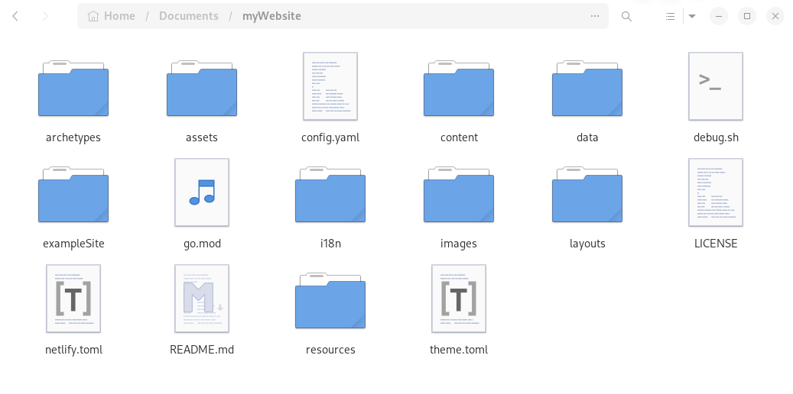
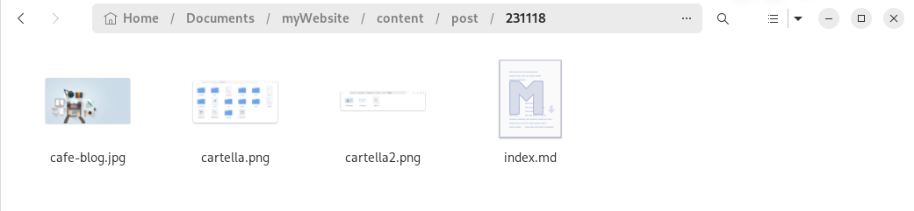
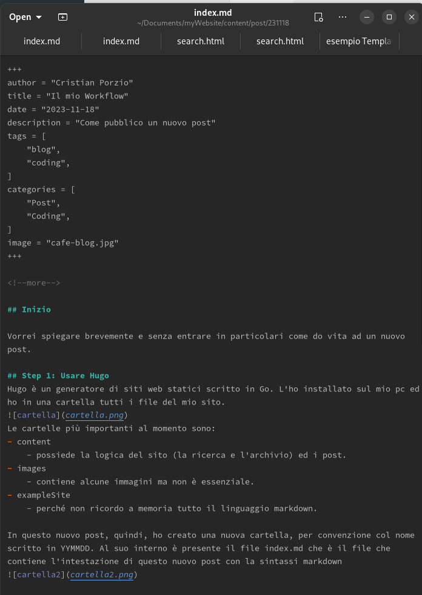
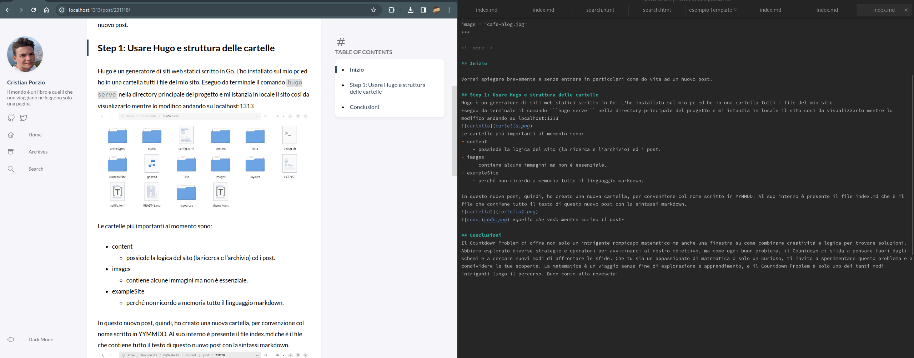
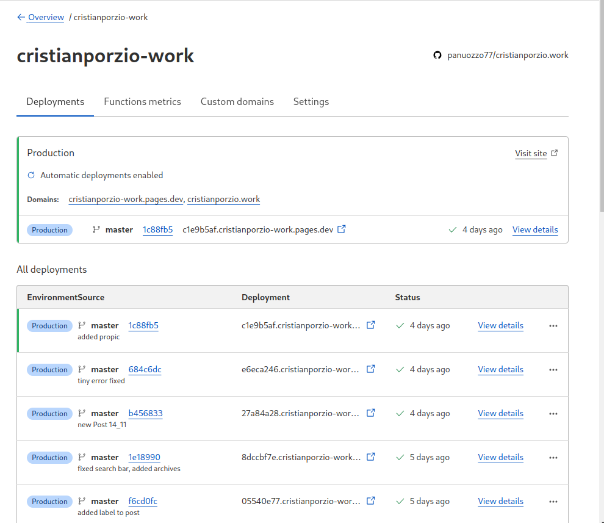

+++
author = "Cristian Porzio"
title = "Come creo un post"
date = "2023-11-18"
description = "Il workflow prima della pubblicazione"
tags = [
    "blog",
    "coding",
]
categories = [
    "Post",
    "Coding",
]
image = "cafe-blog.jpg"
+++

<!--more-->

## Inizio

Vorrei spiegare brevemente e senza entrare in particolari come do vita ad un nuovo post.

## Step 1: Usare Hugo e struttura delle cartelle
Hugo è un generatore di siti web statici scritto in Go. L'ho installato sul mio pc ed ho in una cartella tutti i file del mio sito.
Eseguo da terminale il comando ```hugo serve``` nella directory principale del progetto e mi istanzia in locale il sito così da visualizzarlo mentre lo modifico andando su localhost:1313

Le cartelle più importanti al momento sono:
- content
    - possiede la logica del sito (la ricerca e l'archivio) ed i post.
- images
    - contiene alcune immagini ma non è essenziale.
- exampleSite
    - perché non ricordo a memoria tutto il linguaggio markdown.

In questo nuovo post, quindi, ho creato una nuova cartella, per convenzione col nome scritto in YYMMDD. Al suo interno è presente il file index.md che è il file che contiene tutto il testo di questo nuovo post con la sintassi markdown.

 *quello che vedo mentre scrivo il post*
 *quello che vedo **veramente** mentre scrivo il post*

## Step 2: uploadare su GitHub
A questo punto, terminata la scrittura tutte queste belle modifiche sono solo in locale... Ho bisogno di qualche provider che mi permetta di pubblicarle online... GitHub mi permette di pubblicare tutti i file del sito. Non trattandosi di informazioni riservate né di foto private e compromettenti non ci sono particolari problemi nell'avere queste informazioni in giro per il web. Di buona norma, devo prima selezionare i file modificati con:
```shell
git status //mi mostra tutti i file modificati
git init . //aggiunge tutti i file alla commit
git commit -m "Messaggio della commit" //crea la commit e le aggiunge un titolo
git push //invia nella repository remota di GitHub la commit
```

## Step 3: E Cloudflare builda e pubblica

Dopo aver creato una GitHub action alla repository in questione questa viene buildata e pubblicata sul web [qui](https://cristianporzio.work)


## Conclusioni
In realtà il processo è un po'più lungo di così e c'è bisogno anche di un po'di dimestichezza in quello che si fa però non è qualcosa di impossibile. Letteralmente questo sito web mi sta costando soltando 6€ l'anno e non è per nulla una cifra folle. Al momento non ho ulteriore tempo da poter perdere su un sito web dinamico, quindi questo mi basta ed avanza, nonostante le limitazioni. Una cosa che odio è che Hugo durante la compilazione comprime le immagini e le rende sgranate, rovinando l'estetica del sito. Vorrei cercare di implementare successivamente una pagina che si colleghi alla mia pagina di Notion dove appunto i vari libri che sto leggendo. Magari ne recensirò anche qualcuno. Si vedrà.
